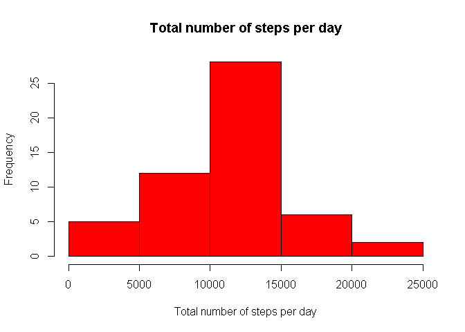
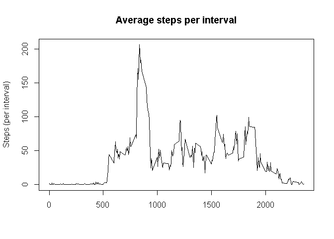
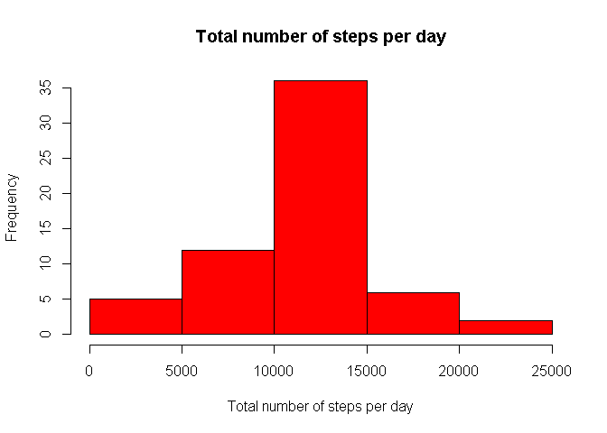
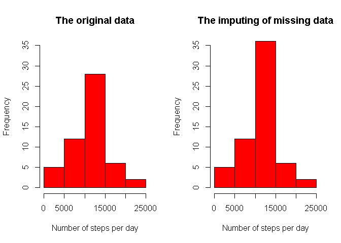
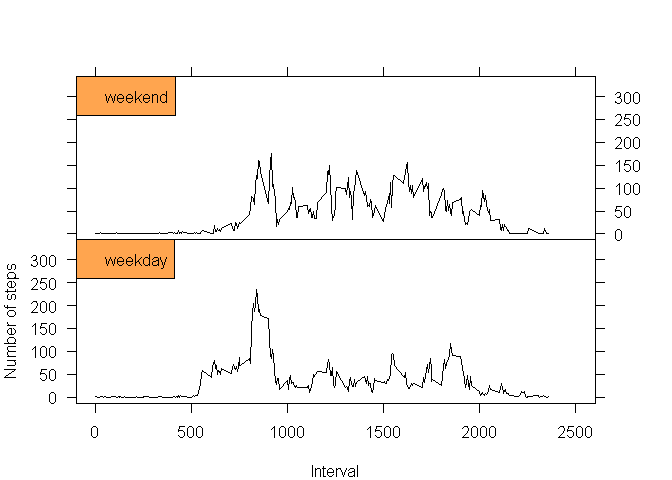

# Reproducible Research: Peer Assessment 1


##1. Loading and preprocessing the data

```r
activity <- read.csv("activity.csv", header = TRUE, sep = ",", quote = "\"",
                     dec = ".", fill = TRUE, comment.char = "")
```
##2. What is mean total number of steps taken per day?

  2.1. Calculate the total number of steps taken per day

```r
total_per_day <- aggregate(steps ~  date, data = activity,
                           FUN = sum, na.rm = TRUE)
```
                           
  2.2. Histogram of the total number of steps taken each day

```r
hist(total_per_day$steps, freq = TRUE,  col = "red", border = NULL,
     main = "Total number of steps per day",
     xlab = "Total number of steps per day",
     axes = TRUE
)
```

 

  2.3. Calculate and report the mean and median of the total number of  steps taken per day

```r
mean_of_total_per_day <-  mean(total_per_day$steps, trim = 0, na.rm = FALSE)
median_of_total_per_day <- median(total_per_day$steps, na.rm = FALSE)
```


## 3. What is the average daily activity pattern?

```r
average_per_interval <- aggregate(steps ~  interval, data = activity,
                           FUN = mean, na.rm = TRUE)
```

  3.1. Make a time series plot (i.e. type = "l") of the 5-minute interval (x-axis) and the average number of steps taken, averaged across all days (y-axis)

```r
plot(average_per_interval$interval, average_per_interval$steps,
     main = "Average steps per interval",
     type = "l",
     ylab = "Steps (per interval)",
     xlab = ""
)
```

 

  3.2. Which 5-minute interval, on average across all the days in the  dataset, contains the maximum number of steps?

```r
average_per_interval$interval[which.max(average_per_interval$steps)]
```

```
## [1] 835
```


## 4. Imputing missing values

  4.1. Calculate and report the total number of missing values in the dataset (i.e. the total number of rows with NAs)

```r
length(activity$steps[is.na(activity$steps) == TRUE])
```

```
## [1] 2304
```

  4.2. Strategy - filling in missing values with rounded mean for that 5-minute interval

  Create a new dataset that is equal to the original dataset but with the missing data filled in.

```r
aa <- merge(activity, average_per_interval, by = "interval", sort = FALSE)

aa$steps <- aa$steps.x
aa$steps[is.na(aa$steps.x) == TRUE] <-
    round(aa$steps.y[is.na(aa$steps.x) == TRUE])

aa <- aa[order(aa$date, aa$interval),]

imputed_activity <- aa[ ,c("date", "interval", "steps")]
rownames(imputed_activity) <- NULL
#rm(aa)
```

  4.3. Make a histogram of the total number of steps taken each day and 

```r
total_per_day_i <- aggregate(steps ~  date, data = imputed_activity,
                           FUN = sum, na.rm = TRUE)

hist(total_per_day_i$steps, freq = TRUE,  col = "red", border = NULL,
     main = "Total number of steps per day",
     xlab = "Total number of steps per day",
     axes = TRUE
)
```

 
  Calculate and report the mean and median total number of steps taken per day. 

```r
mean_of_total_per_day_i <-  mean(total_per_day_i$steps, trim = 0, na.rm = FALSE)
median_of_total_per_day_i <- median(total_per_day_i$steps, na.rm = FALSE)
```
  Do these values differ from the estimates from the first part of the assignment?
  What is the impact of imputing missing data on the estimates of the total daily number of steps?

```r
par(mfrow = c(1, 2))

hist(total_per_day$steps, freq = TRUE,  col = "red", border = NULL,
     main = "The original data",
     xlab = "Number of steps per day",
     ylim = c(0,35),
     axes = TRUE
)

hist(total_per_day_i$steps, freq = TRUE,  col = "red", border = NULL,
     main = "The imputing of missing data",
     xlab = "Number of steps per day",
     ylim = c(0,35),
     axes = TRUE
)
```

 

## 5. Are there differences in activity patterns between weekdays and weekends?

  5.1. Create a new factor variable in the dataset with two levels – “weekday” and “weekend” indicating whether a given date is a weekday or weekend day.

```r
library(lubridate)

aa$wd0 <- wday(as.Date(aa$date),  label = FALSE, abbr = TRUE)

activity$wd <- "weekday"
activity$wd[wday(as.Date(activity$date),  label = FALSE) == 7] <- "weekend"
activity$wd[wday(as.Date(activity$date),  label = FALSE) == 1] <- "weekend"

activity$wd <- as.factor(activity$wd)

class(activity$wd)
```

```
## [1] "factor"
```

  5.2. Make a panel plot containing a time series plot (i.e. type = "l") of the 5-minute interval (x-axis) and the average number of steps taken, averaged across all weekday days or weekend days (y-axis).
  See the README file in the GitHub repository to see an example of what this plot should look like using simulated data.


```r
average_per_interval_wday <- aggregate(steps ~  interval,
            data = activity[which(activity$wd == "weekday"), ],
            FUN = mean, na.rm = TRUE
            )
average_per_interval_wend <- aggregate(steps ~  interval,
           data = activity[which(activity$wd == "weekend"), ],
           FUN = mean, na.rm = TRUE
            )
```


```r
par(mfrow = c(2, 1) )

par(mar = c(0, 4, 4, 4)   )
plot(average_per_interval_wend$interval, average_per_interval_wend$steps
     # , main = "weekend"
     , type = "l"
     , axes = FALSE
     , xlim = c(0,2500)
     , ylim = c(0,330)
      , ylab = ""
      , xlab = ""
)
axis(2, labels = FALSE); axis(3, labels = FALSE)
par(ann = TRUE); axis(4, las = 2); box(which = "plot", lty = "solid")
legend("topleft", bg = "tan1", legend = "weekend", inset = 0)

par(mar = c(4, 4, 0, 4)   )
plot(average_per_interval_wday$interval, average_per_interval_wday$steps
     # , main = "weekday"
     , type = "l"
     , axes = FALSE
     , xlim = c(0,2500)
     , ylim = c(0,330)
     , ylab = "Number of steps"
     , xlab = "Interval"
)
axis(1); axis(2, las = 2) 
axis(4, labels = FALSE); box(which = "plot", lty = "solid")
legend("topleft", bg = "tan1", legend = "weekday", inset = 0)
```

 

